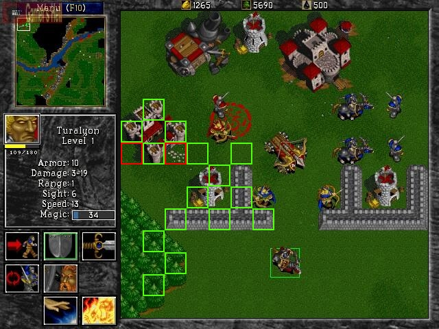
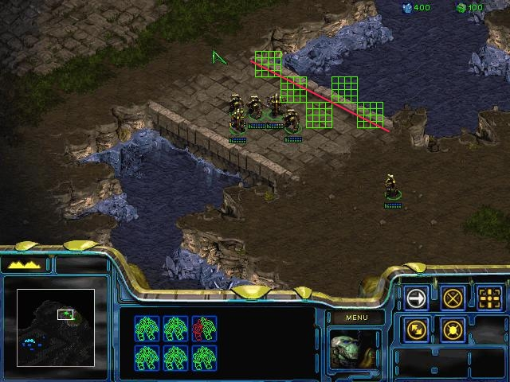
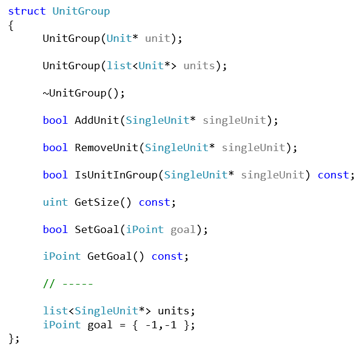
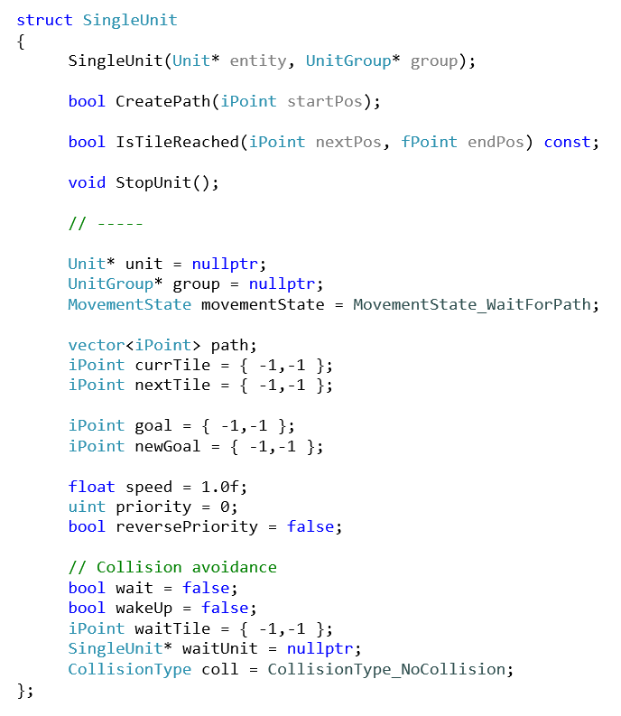
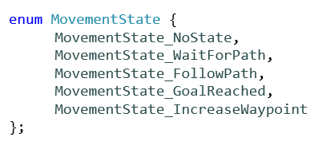
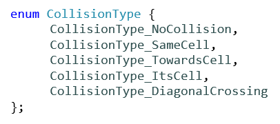

# RTS Group Movement

I am <a href="https://www.linkedin.com/in/sandra-alvarez-45453215b/">Sandra Alvarez</a>, student of the <a href="https://www.citm.upc.edu/ing/estudis/graus-videojocs/">Bachelor’s Degree in Video Games by UPC at CITM</a>. This content is generated for the second year’s subject Project 2, under supervision of lecturer <a href="https://es.linkedin.com/in/ricardpillosu">Ricard Pillosu</a>.

<I>NOTE: although this research focuses mainly on real-time strategy (RTS) games, the methods described can easily be applied to games of other genres.</I>

## Intro to the subject

“Game-unit pathfinding is something that most players never notice until it doesn’t work quite right, and then that minor issue becomes a rage-inducing, end-of-the-world problem” says Patrick Wyatt, a game programmer who worked on <I>StarCraft</I>.

Moving troops in groups via complex terrain is a challenge that many games have to deal with, specially real-time strategy games, where hundreds of units compete for the same destinations. The main question is, how do we make units cooperate with each other, so they move around without causing a terrible chaos? While the first part of the answer is pathfinding, the technique of finding paths from one location to another, the second part is movement. Without controlling the movement, units would behave individually, without taking in account the behaviors of the rest of the units. Here is, then, where coordinated movement comes in.

Coordinated movement is the result of combining two processes. The first one is pathfinding, while the second one is movement, the execution of a given path.

## How different games have approach it

Before we start to implement our coordinated movement system, we should understand precisely how coordinated movement works. To do so, there is no better way than to take a look at some existing games that have it. First, we will analyse how it is felt in the game (from the player's perspective). Then, we will dive deeper to investigate the method/s behind it.

### Command & Conquer: Tiberian Dawn (1995)

- Units always calculate the shortest route possible, even if this means getting through an enemy's trap. Thus, if units are shot while moving, they don't fire back.
- When a harvester attempts to return to the base while another harvester is going out to collect resources, if their routes share the same narrow path, the two of them will sometimes meet. If they do, they will turn twice (each time continuing to block each other's progress), center their orientation, and finally move right through each other.

<iframe width="560" height="315" src="https://www.youtube.com/embed/AGtd0KkOvG4?start=400" frameborder="0" allow="autoplay; encrypted-media" allowfullscreen></iframe>

The shortest distance is determined with algebra, not calculus. Consequently, the resulting path only takes into account the distance from point A to point B, ignoring any obstacles. This makes units overlap each other when they move, but if they do overlap, they will spread out again when reaching their destination.

### Warcraft I (1994) and II (1995)

- Every time a group of defensive units (still units) is attacked, the individual units will move further and further away.
- The armies head straight for their destination, going left or right when they hit something, then giving up after a while.
- It can take a unit 45 seconds to go from one end of the map to the other. In that time, new structures may have been built, making the original path invalid, or trees may have been chopped down, making the original path a very poor choice.
- Units often block each other. E.g.: peasants heading to the gold mine block peasants returning from it, because the only valid path for each group is blocked by the other group.

<I>Warcraft</I> engine is optimized to draw 32x32 pixel square tiles made of 16 8x8 pixel square cells (orthogonal perspective). The camera perspective of <I>Warcraft I</I> and <I>Warcraft II</I> is almost top-down, so the edges of the objects (buildings, etc.) are either horizontal or vertical. This leads to easy pathfinding, because each 32x32 tile is either passable or un-passable.

However, some tiles seem passable but actually are not. For example, the barracks building artwork does not fill completely the 96x96 area it sits on, and it leaves two tiles that seem passable but actually are not.

_Warcraft II map with 32x32 tiles. The two tiles that seem passable but actually are not are drawn in red_

### StarCraft (1998)

- Units stop when they detect an object in front and politely wait for the object to move before continuing along the path.
- Units do not walk on top of each other, even if this means taking longer to get from point A to point B. Consequently, units remain visually separated.
- Harvesting units (Terran SVC, Zerg drone, Protoss probe) would get jammed up trying to harvest crystals or vespene gas (hereafter "minerals") and they would grind to a halt, because they are constantly running headlong into other harvesters traveling in the opposite direction. To avoid this situation, they ignore collisions with other units, so they can operate efficiently.

<iframe width="560" height="315" src="https://www.youtube.com/embed/0oJPPCaQeD4" frameborder="0" allow="autoplay; encrypted-media" allowfullscreen></iframe>
  
<I>StarCraft</I> was built on the <I>Warcraft</I> engine (orthogonal perspective), but along the way the development team switched to isometric artwork to make the game more visually attractive. However, the terrain engine was not re-engineered to use isometric tiles. In order for pathfinding to work properly it was necessary to increase the resolution of the pathfinding map. Now, each 8x8 tile was either passable or unpassable. The increase in the size of the pathfinding map by a factor of 16 involved more computational effort when searching for a path. In addition, diagonal edges drawn in the artwork split many of the square tiles unevenly, making it hard to determine whether a tile should be passable or not.

Because the project was always two months from launch, there was no time to re-engine the terrain engine, so the pathfinding code had to be made to work. The pathfinding code, then, turned into a gigantic state-machine which handled all the tricky edge-cases.

_StarCraft map with 8x8 cells. The red line cuts each 8x8 cell into an irregular shape_

### StarCraft II: Wings of Liberty (2010)

- Units of all sizes find their way to destinations, without overlapping each other and without stopping.
- Smooth flow of the units.

<iframe width="560" height="315" src="https://www.youtube.com/embed/LztRm_bXGcc" frameborder="0" allow="autoplay; encrypted-media" allowfullscreen></iframe>

### Supreme Commander 2 (2010)

The same annotations than in <I>StarCraft II: Wings of Liberty</I>.

<iframe width="560" height="315" src="https://www.youtube.com/embed/bovlsENv1g4" frameborder="0" allow="autoplay; encrypted-media" allowfullscreen></iframe>

## Methods to approach it (used by the previous games)

### Tile-based algorithm A* (A-Star)

###### Pathfinding technique: A*

The games <I>Command & Conquer: Tiberian Dawn</I>, <I>Warcraft I: Orcs & Humans</I>, <I>Warcraft II: Tides of Darkness</I>, and <I>StarCraft</I> base their group movement on the tile-based algorithm A* (A-Star). The primitive A* is the most common pathfinding algorithm used by the first RTS games such as the named, which had to deal with much lower processing power. 

###### Movement behavior: set of rules

Since the pathfinding algorithm A* only takes into account the terrain (and, if modified, the objects of the map), it has to be complemented by a set of rules, which vary depending on the game and its needs. For example, in <I>Warcraft II</I>, a rule says that if a unit runs into other units and cannot slide past them, it will repath an alternate route. This works fine for a samll number of units, but when trying to navigate a large number of units through a narrow passage, a few will inevitably run into the units ahead of them and find another path.
  
As seen, those rules are very limited. In some situations, they force games to sacrify more natural behaviors to make the whole system work. A true shortest path algorithm can be immensely annoying to gameplay, due to human perception. That is a pitfall the game designer must take into consideration when picking an algorithm. From the limitations behind the tile-based algorithm A* when dealing with group movement, it came out the Flocking System with Flow Fields.

### Flow Fields + Flocking (or Swarm) Behavior

The games <I>StarCraft II: Wings of Liberty</I> and <I>Supreme Commander 2</I>, and the great majority of modern RTS games use a Flocking System with Flow Fields to maintain fluid control of large groups of units. A local dynamic Flow Field is generated around each unit. The Flow Fields of the units are combined together before adjusting the units' movements.

###### Pathfinding technique: Flow Fields

Flow Fields are an alternate way of doing pathfinding which works better for larger groups of units. A Flow Field is a grid where each grid square has a directional vector. This vector should be pointed in the direction of the most efficient way to get to the destination, while avoiding static obstacles.

###### Movement behavior: Flocking (or Swarm)

The flocking model was defined by Craig Reynolds, an artificial life and computer graphics expert. Flocks, by definition, are a group of birds traveling together. Reynolds called the generic simulated flocking entities "boids", creating the Boids artificial life simulation (1986). The basic flocking model consists of three simple steering behaviors (separation, alignment and cohesion) which describe how an individual boid moves based on the positions and velocities of its nearby flockmates. As a result, entities in a flock (or boids) travel at roughly the same speed and form a cohesive group without strict arrangement.

The algorithm finds the fewest amount of waypoints and allows autonomous steering behaviour for units to smoothly hug their way around obstacles and its immediate neighbors. Logically, every unit has sensors which, when colliding with another unit, notify the first unit to turn in an appropriate direction to avoid the other unit.

## How we are going to approach it

From the two methods described, we will follow the first one. This means that we are going to implement a set of rules which allows individual units to execute paths (already found by the A* pathfinding algorithm) while moving together as a group. To do so, we will combine the functionalities of two different modules, which are independent from each other, one for each of the components of the group movement:

**1. Pathfinding module.** _Already implemented_. 
**2. Movement module.** _Needs to be implemented_.

Since the first one, the Pathfinding module, will be already implemented, we will focus on the implementation of the second one, the Movement module. The Movement module will be in charge of managing groups and units, and the execution of their individual paths (provided by the Pathfinding module).

### Groups and Units

_Struct for a group of units_

_Struct for a single unit_

### Simple Movement Algorithm

<I>StarCraft</I> relies almost solely on the pathfinding algorithm A* to move units from one point to another, mapping every single node that the unit needs to traverse over. In <I>StarCraft II</I>, a lot of the pathfinding is lef up to the unit, and waypoints are kept to minimum.

_Enum with all of the possible states of a unit's movement_

###### Implementation

1. When a unit is issued a command, the parameters of that command (the current location and the destination in the grid) are run through the pathfinding algorithm, which spits out an array of path coordinates (waypoints). The unit stores the path found, which is free of static obstacles (known as unwalkable tiles).

**PROBLEM 1. Shared destination.** If the unit is in a bigger group, only the first unit of the group calculates the path to the goal set by the user. The rest of the units' destinations are offset from that point and calculated after, one at a frame. This prevents the units to finish the path all to the same spot. Besides that, if every unit has its own path to its own unique destination, the whole movement of the group looks more natural, because paths tend to have less waypoints in common. This minimizes the chance of collision between the units along the path.

2. The unit moves along the path, but it only goes 1 square at a time, due to the need of local collision determination. Before making the move, the unit just asks the path which direction it's supposed to go next. After that, it tries to move there.

###### FAQ

**When is the path recalculated?**
- When a new move command is issued while the unit is en route. This behaviour has given rise to SPAM-CLICKING. The path is literally re-calculated each time you click, so technically a unit is finding the most efficient path at the point of time closest to the click.
- When the next node of the path is occupied by another unit and the treatment of the collision found requires to (the unit is stuck).

**Why do not automatically recalculate the path?**
If the path is the most accurate when it is newly created, why do not automatically recalculate it instead of only doing it on click or when a certain type of collision is found? Because the pathfinding algorithm calculations are expensive, even by modern computing standards. Depending on the size of the grid, calculating hundreds of paths for hundreds of units adds up.

Movement is strictly limited to cardinal direction (N, S, E, W, NE, NW, SE, and SW), and units cannot move forward 1 degrees, back 2 degrees, left 3 degrees, etc. This is why the <I>StarCraft</I> movement feels so blocky sometimes. If units moved outside the grid, like in <I>StarCraft II</I>, they would not be able to ask the question “is the node I am walking to occupied?”, which is the core of the local avoidance algorithm that we are going to implement next.

### Collision System

The A* algorithm takes into account only static obstacles. This means that dynamic obstacles like units are ignored when calculating the path. It is in the units' hands to avoid the dynamic obstacles, then. This is achieved with the Collision System, which is made of two smaller systems, the Collision Prediction System (which is run first) and the Collision Avoidance Sytem (which is run only if the Collision Prediction System determines a collision).

In <I>StarCraft</I>, units are constrained by the fact that they are competing for waypoints. They are constantly stopping and moving because each time they travel to a new node they ask "is the next node that I want to walk to occupied?" to the Collision Prediction System. If the answer is "no", they keep moving along the path. If the answer is "yes", the Collision Avoidance System processes the collision and gives orders to the unit to execute specified commands. Those commands may involve the creation of a new path.

In <I>Starcraft II</I>, units avoid obstacles and other units (but also flock together) using steering behaviour. This allows units to weave in and out without calculating a whole new path or losing momentum. In a worst case scenario, the units can even ignore the collision radius, allowing for more fluid movement and higher movement efficiency overall.

###### Implementation

**PROBLEM 2. Dealing with dynamic obstacles (moving and still units)**

3. Before getting to the next position, units must process this next position through the Collision Prediction System, in order to predict collision with the other units in the environment.
4. If a collision is found, the unit has to avoid (before it happens) it by following the rules of the Collision Avoidance System. If there is no collision, then the unit can go on its way.

###### Collision Prediction System

In each frame of the simulation, each unit needs to check for future collisions with all other units in the scene. This is done by processing the next tile the unit wants to go to through the collision prediction system. The possible situations of collision are:

**1. Two agents reach the same cell (_SameCell_).**
**2. Two agents reach the cell of each other (_TowardsCell_):** occurs if the agents are walking towards each other (in opposite directions).
**3. An agent reaches the cell of another agent (_ItsCell_).**
**4. Two agents cross diagonally, reaching the cell in front of each other (_DiagonalCrossing_).**

_Enum with all of the possible types of collision_

###### Collision Avoidance System

Collision avoidance between units can involve some problems that only appear when we deal with many units, so a method to avoid collision between individuals can be inefficient when we have several ones.

If a collision is predicted, one of the two units involved must act consequently, so it avoids the collision before it happens. Each unit has a priority and several ones could have the same priority, so the unit with the lower priority will always have to let the unit with the higher priority pass. The responses to the different situations of collision are:

**1. _SameCell_ (conflict cell: the tile both units want to go to):** the unit waits until the other unit has reached the conflict cell and has updated its next position with the next waypoint of its path.
**2. _TowardsCell_ (conflict cell: any of the two tiles):** since units get stuck, the unit has to find a new next tile to go to and then recalculate its path.
**3. _ItsCell_ (conflict cell: the tile of the other unit):** the unit waits until the other unit is no longer on the conflict cell.
**4. _DiagonalCrossing_ (conflict cell: the tile where the other unit wants to move to):** the unit waits until the other unit has reached the conflict cell.
**5. One of the units is still (conflict cell: the tile of the unit that is still, which is the next tile of the other unit):** if the unit with the higher priority is the unit that is still, it has to find a new goal and start walking towards it. If the unit with the higher priority is the other unit, the one that is walking, it has to find a new next tile to go to and then recalculate its path.

The behavior in the next frame of each unit depends on the type of collision prediction and the type of collision avoidance.

How do we avoid them lining up?

## Links to more documentation

## TODOs

### Homework (optional)

If this research caught your eye and you want to keep practising, I suggest you to try to add one or all of the following improvements to the group movement system.

1.
2. Formations. Generate formations around the clicked location.
Check out how <I>Rise of Nations</I> (2003) does formations! When you click on your destination, if you hold the mouse button down and drag, small circles are drawn on the tiles, showing the formation that the selected units would made.
PLUS: it also has smart systems where the melee is in front, the ranged behind, with artillery behind them.

